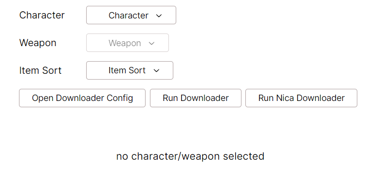
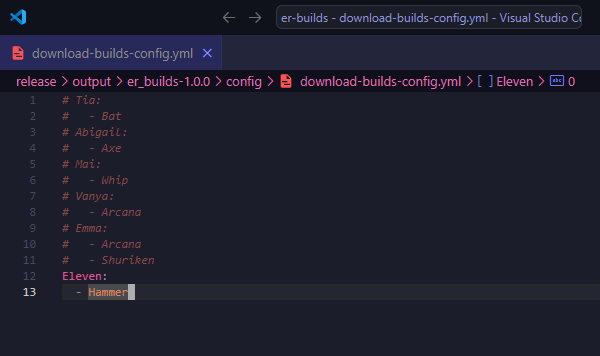
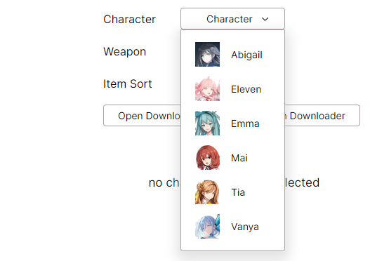

# How to Run
Launch `erbuilds.exe`. It should open the ER Builds UI page automatically in your browser.

# Downloading Data
On the Web page, click "Open Downloads Configuration File". It will open the configuration file in your default editor for yaml files.

Fill out (or uncomment) the characters/weapons you would like to be downloaded.

Click "Run Data Downloader" on web page to run data download. This will open a downloader window, press Enter when it is done.

Reload page after it is done.

img of the data download happening 

Select the character and weapon in the dropdowns.

You can also run the data-downloader.exe independently from the webpage.