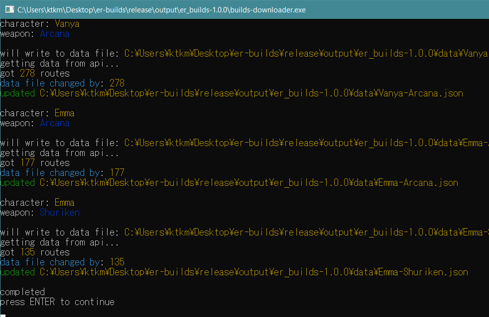
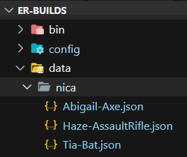

# How to Run
Launch `erbuilds.exe`. It should open the ER Builds UI page automatically in your browser.

# Downloading Data
On the Web page, click "Open Downloads Configuration File". It will open the configuration file in your default editor for yaml files.

Fill out (or uncomment) the characters/weapons you would like to be downloaded.

Also make sure to update the "versions" list at the top. You can check [dak gg](https://dak.gg/er/characters) for the current version (look for the version dropdown at top right of any character).

Click "Run Data Downloader" on web page to run data download. This will open a downloader window, press Enter when it is done.

Reload page after it is done.

Select the character and weapon in the dropdowns.

You can also run the data-downloader.exe independently from the webpage.

# Nica Downloader
To see **Augments and Late Game Items**, the Nica Downloder can be used. This program uses the same config file as before.

Press "Run Nica Downloader" to run. Similar to the Builds Downloader, it will download for all options in the config file.

 img of download

Reload the page and should now see Augments and Late Game Items.

## Note: How to Overwrite Downloaded Nica Builds
Currently, when downloading Nica Builds, the downloader **will not overwrite old builds** if it detects it already downloaded it. This is to save spamming Nica Api too much.

This behaviour might be changed in the future, but for now, if you want to overwrite and refresh Nica Builds for a character, you will need to delete the Nica json data for that character.

This can be found in the `data/nica` folder.

The Builds Downloader will always update with new data, so you don't need to delete those jsons unless you want to **purge builds from older versions**, as those will be kept in the data files.