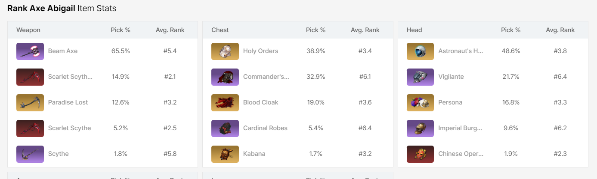
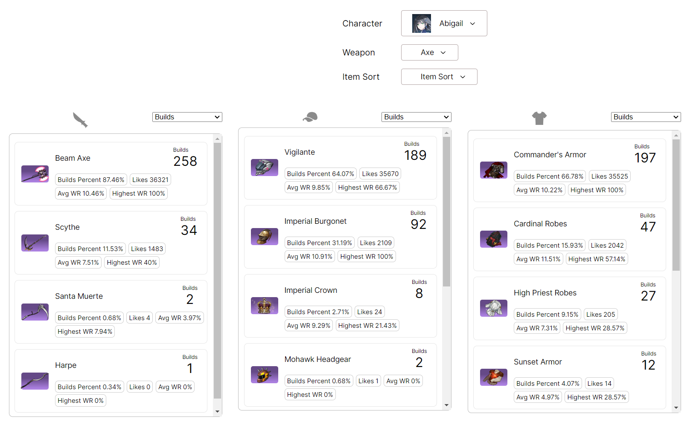
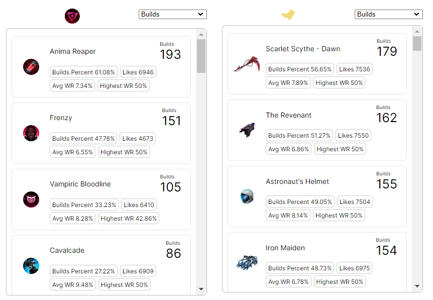

# ER Builds Analysis Tool
Item stats display tool for [Eternal Return](https://store.steampowered.com/app/1049590/Eternal_Return/). Currently only supports windows.

ER Builds is based on [dak.gg](https://dak.gg/er/characters), but instead of presenting only the top 5 items per item category:

*(image from dak.gg)*

ER Builds presents all the items per category, including special other categories such as Augments and Late Game Items. This can be useful during build construction when you want to see more than just the top 5 items. Additionally, it presents more statistics than just Pick % and Average Rank.

*(image of ER Builds tool)*

Augments and Late Game Items

# Usage
[Usage Guide](./doc/usage-guide.md)

# Features
- **Webpage display**: Collected information is displayed on a UI page.
- **Multiple Sort Options**: Item statistics can be sorted by various values.
    - Number of Builds and Build %
    - Number of Likes
    - Build/Like ratio
    - Average and Highest Win Rate
- **Offline Data Store**: ER Builds collects data from API and stores on disk, so accessing the API is not spammed. User can easily choose which characters they would like to retrieve data for, and can update on demand.

# Possible Future Features
- **Tac Skills**: The tool could collect information about what tac skills are being selected in builds.
- **Late Game Item Categories**: Late game items could be further split into their item types for easier comparison.
- **Improved Data Collector Runners UI**: The config file to manage downloaded data isn't the best and could be improved.
- **UI For Selecting Characters for Data Collection**: Right now this feature is configured through a file, but a UI can make this better.
- **Item Stats Display**: The tool does not yet display the stats of an item on hovering over it like dak.gg.
- **Update current character button**: It is common to want to know if the current character's info is up to date instead of always updating all characters.

# Enhanced Build Info
Collection of enhanced build information such as **Augments and Late Game Items** depends on [nicashow api](https://github.com/Eternal-Return-Community).

The API is not accessed unless using the **Run Nica Downloader** option, in case you don't want to be accessing the third-party api.

# Development Information
[Development Notes](./doc/dev-notes.md)